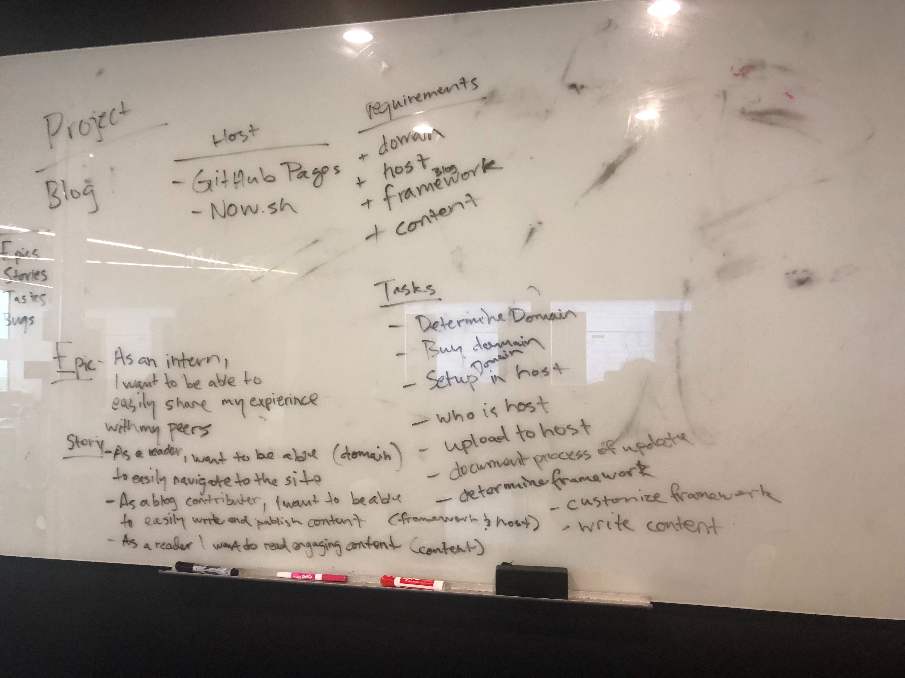

We want to give a special thanks to Marcus Carter who helped us complete this project, we couldn't have done it without him. 

<h3 style="text-align: center;">Our Project</h3>

 

This website was created by [Saidi Zelaya](https://github.com/SaidiElle) and [Justice Matthews](https://github.com/Demonitized) using a Gatsby framework. We decided to do this because we are both fond of coding, and we wanted a project and a challenge.

For some reason every internship that we get is always nerve wracking. As students have so little information, sometimes we ask our teachers questions that they are unable to answer, or we have no idea if we are actually ready for an internship, and other relatable questions.

This is the reason why we wanted to do this. We wanted students to understand everything when they apply for an internship. We noticed that we struggled because we don't have the information necessary. I remembered I asked one of my teachers, "What are we going to do there(at the internship)?", and he fell into a deep thought and answered, "I don't know," at first I was going insane. I mean, I was going to a big company, not knowing any information, I did not know if I was capable enough, had any idea at what time should I be there, or what kind of work we will be doing. All of these thoughts can be scary because you want to give your best impression, you do not want to fail nor make a fool or yourself.

We want to share our experiences at the internships for every upcoming Rooted Student who wants to apply for one, we also want parents to read this kind of content if they want more information as to how these internships are. We want to write many experiences as we can, so we can publish it in this blog and help more students in the long run. Also, this blog is not only limited to students with internships, we want all of the students at Rooted to engage with the content. Any student at Rooted can write for this blog as long as it explains to us why we should publish it.

We hope to receive an email from you about any glitches and bugs on the site and if you have more ideas on how to make this page or the content more engaging, we would appreciate it very much.
